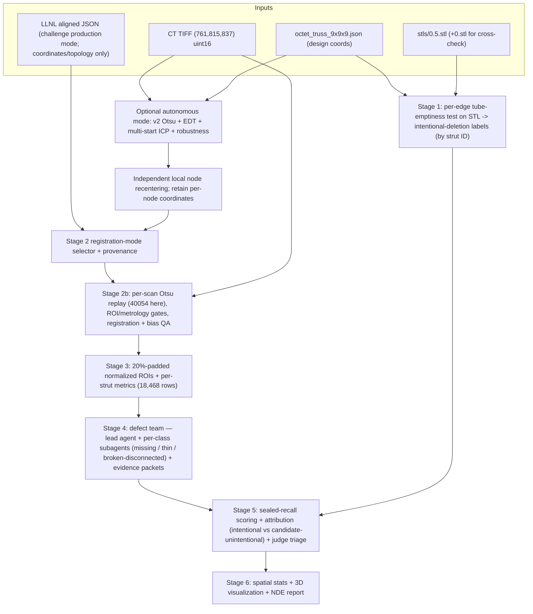

# Part 2 Design — Agentic Missing-Strut NDE Pipeline

**Goal:** a multi-agent system that goes from the `data/missing_struts/` dataset (CT TIFF + nominal lattice graph + design STLs) to a per-strut defect table, a traceable NDE report, and a 3D defect visualization, with a closed evaluation loop. Registration has two supported modes: **(A) challenge mode**, which uses the LLNL-supplied aligned JSON exactly as the challenge README permits, and **(B) autonomous mode**, which uses `poc/ct_registration_v2/` as a CT-only coarse ROI locator followed by independent local node recentering. The aligned JSON contains coordinates and nominal topology, not defect labels, so using it is not answer leakage. This document is the frozen design: architecture, pipeline stages, MCP tools, subagent contracts, skills, and the eval layer.

This design was produced by reviewing every existing component (MCP server, skills, subagents, notes, evals), **verifying the data itself by running code against it** (Section 1), and then passing the draft through an adversarial design review whose fixes are folded in below.

---

## 1. Verified data facts (ground truth for this design)

All numbers below were measured directly from the files in this repo (not taken from notes or briefings).

### 1.1 The CT volume

- `data/missing_struts/tif_stacks/210127_Brian_Tran_strut_lattices_0point5dash1 1 Slices.tif`: **761 pages × (815 rows × 837 cols), dtype uint16, big-endian (`>u2`), ImageJ-written, series axes `ZYX`**, ~990 MiB. No voxel-size metadata in the TIFF.
- **It is md5-identical to `data/9x9x9_octet_lattice/9x9x9_octet_lattice.tif`** — the repo carries the same scan twice, and all Part 1 segmentation work on the latter applies verbatim to the former. **Despite the "octet lattice" folder name, this scan is the 0.5 %-deleted specimen**: the filename (`…0point5dash1…`) and the single provided registered JSON both correspond to `0.5.stl`, so scoring the 0.5 % deletion set against this CT (Stage 5) is coherent — it is not the full/defect-free lattice.
- Full uint16 load ≈ 7 s, ~1.04 GB in RAM. Never cast the whole volume to float (2.1–4.2 GB).
- Edge slices are atypical (slice 0 mean 49,093 and slice 760 mean 44,759 vs slice 380 mean 33,068) — exclude edges from global statistics.

### 1.2 Per-scan exact-histogram Otsu: **40054** for this scan

Registration v2 recomputes Otsu from the complete 65,536-bin uint16 histogram for every scan. On this volume it selects **40054** → foreground **58,653,410 / 519,119,955 voxels (11.2986 %)**. The older Part 1/v1 record selected 40049 → 58,675,274 foreground voxels; the five-intensity-unit difference is operationally negligible, but **40054 is the authoritative v2 value and is never hard-coded for a new scan**. Part 1 selected the lower Triangle threshold 34963 for a visualization-oriented segmentation because Otsu made some struts appear thinner.

- **Frozen rule for Part 2:** recompute exact-histogram Otsu per scan, then persist the threshold, exact histogram, foreground count/fraction, class means, Otsu separability, and significant modes. For this scan, v2 replay must reproduce 40054 and 58,653,410 foreground voxels.
- **Histogram rejection:** v2 halts before fitting if the foreground fraction is implausible, Otsu separability or class separation is weak, or the smoothed diagnostic histogram lacks evidence of multiple modes. This scan passes with separability 0.814, class separation 4.32 pooled standard deviations, and significant modes near 32,288 and 48,992.
- **Why Part 2 overrides Part 1's Triangle pick.** The goals differ. Part 1 wanted faithful struts, so it chose the *lower* Triangle threshold, which renders struts thicker. Part 2 detects *absences*: a lower threshold thickens struts and back-fills genuinely-deleted ones with noise/neighbor bleed, so a deletion still reads as occupied → **false negatives** (missed deletions). A defect-detection threshold must be **blind to how much material "should" be there** — the higher Otsu operating point is what makes a real deletion read as empty. For the same reason we do **not** tune the threshold to hit a target foreground fraction: this specimen is the 0.5 %-deleted part, so fraction-matching would *lower* the threshold to refill the very deletions we are trying to find.
- **Freeze the method, record the value.** These uint16 intensities are uncalibrated reconstruction units, so the exact integer separating titanium and air can drift with acquisition and reconstruction. The config freezes the recipe and acceptance diagnostics, not a universal integer. Stage 2 may compare the resulting ~11.3 % foreground against the design's expected metal fraction as corroboration, never as a threshold-selection knob.
- The mask itself (`mask.tif`, ~495 MB) is **gitignored and absent**: the frozen segmentation is a *recipe*, not a file. Stage 2 regenerates it deterministically.

### 1.3 ⚠ Axis mapping (silent-failure hazard)

Registered-JSON positions are `[x, y, z]`; the numpy array is `(Z, Y, X) = (761, 815, 837)`. **Correct sampling is `vol[round(z), round(y), round(x)]`.** The supplied registration validates this mapping, and v2 independently achieves a **92.31 % mean 5×5×5 foreground fraction** over all 10,206 node records at its per-scan Otsu threshold (§1.7). Every plausible wrong mapping scores far worse (2.1–67.1 %), and `vol[x][y][z]` **goes out of bounds** (x max 773.7 > 761 pages). The briefing's "837×815×761" is X-by-Y-by-Z, i.e. reversed from numpy order. This mapping is pinned in the config and inside registration, QA, and corridor-sampling tools — no agent ever indexes the raw array from prose instructions.

### 1.4 The lattice graphs

- `octet_truss_9x9x9.json`: keys `junctions` / `struts` / `unit_cells` (note: `unit_cells`, not `cells`); **10,206 junctions, 18,468 struts, 729 unit cells**; junction ids 0–10,205 and strut ids 0–18,467 sequential; all junction pairs unique; nominal coordinates span exactly [0, 18] per axis; every strut has `thickness = 0.1` (design units).
- The nominal graph, the v1/v2 CT-derived graphs, and the LLNL-supplied aligned graph preserve the same **10,206 / 18,468 / 729 structure and topology field-by-field**; only junction `position` values change. **Therefore strut labels derived in design space transfer 1:1 to CT space by strut ID.** The supplied graph contains only `junctions`, `struts`, and `unit_cells`; it contains no defect, missing, broken, disconnected, label, or ground-truth fields. In challenge mode it is the canonical production graph. In autonomous mode, Stage 2 writes `analysis/registration/our_registered.json` from v2 and records which mode produced every downstream artifact.

### 1.5 The STLs

- All four are **binary** STL: `0.stl` = 3,514,642 triangles; `0.1.stl` = 3,511,458; `0.5.stl` = 3,498,656; `1.stl` = 3,482,368. Triangle deficits vs `0.stl` (3,184 / 15,986 / 32,274) are **~172–177 triangles per removed strut** against the tube-emptiness POC's measured **18 / 93 / 186** removed struts (0.1 / 0.5 / 1 % of 18,468; `poc/tube_emptiness_test/results/`) — a highly consistent ratio (176.9 / 171.9 / 173.5) that serves as a built-in consistency check.
- `trimesh` loads one in ~5 s with `process=False`. Units are **mm, origin-centered** (bounds ± ~20.7 mm in X/Z), unlike the 0–18 nominal frame. **The Y extent is 51.04 mm vs 41.49 mm in X/Z — the STL contains ~9.5 mm of extra non-lattice geometry (tabs/plates) along Y.** Bounding-box registration is therefore forbidden; the mm→design transform must be fitted on lattice geometry only.
- Scale: 41.493 mm / 18 design units = **2.3052 mm per design unit** (unit cell ≈ 4.61 mm vs README's 4.56 mm, ~1 % off). Combined with registered spans (39.72 voxels/design unit) this implies **~58.0 µm per voxel**, consistent with the externally-claimed 58.09 µm — which is otherwise recorded **nowhere** in the repo and must be treated as an external constant.

### 1.6 ⚠ Strut diameter ambiguity

JSON `thickness = 0.1` design units ≈ **231 µm**, which matches neither the README's 350 µm (≈ 6.03 voxels) nor the paper-derived 424 µm noted in `notes/CHALLENGE_NOTES.md`. **Never use JSON thickness as a physical diameter.** The pipeline derives the nominal radius empirically (Stage 3 bootstrap, §4) and reports all three candidates.

### 1.7 CT registration v2: robust coarse ROI localization, not metrology

`poc/ct_registration_v2/fit_registration.py` recovers a global 7-DOF similarity transform from the **nominal graph plus CT intensities only**. Its CLI has no ground-truth input. It computes per-scan exact-histogram Otsu; detects factor-two EDT node candidates; withholds 20 % of candidates from fitting; runs 21 independent rotation/scale starts; performs full-resolution local EDT refinement; sweeps nearby thresholds, EDT settings, ICP trim fractions, and paired bootstrap samples; validates all 10,206 node records and all 18,468 strut corridors in image space; hashes the frozen artifacts; and writes `FIT_COMPLETE.json` last. Only the separate validator may then open the supplied aligned JSON.

**V2 CT-derived transform:**

- **Uniform scale 39.178740 voxels/design unit**
- **Rotation 0.398026°**
- **Translation (60.922422, 55.682321, 29.656710)** voxels in (x, y, z)

**Internal evidence:** 12/12 synthetic recovery cases pass despite noise, 20 % missing nodes, and 25 % outliers; all 21 near-optimal starts converge to the same solution; mean 5×5×5 junction foreground is **92.31 %**; median all-edge corridor occupancy is **0.385**; and X/Y/Z corridor-bin median ranges are 0.039/0.034/0.084. Threshold, EDT, and paired-bootstrap perturbations remain within 0.975 voxels. The 0.75 ICP trim case moves predictions by P95 **3.056 voxels**, so v2 correctly fails its stricter **2-voxel metrology/direct-corridor gate**.

**Post-fit held-out evidence:** median node error **3.705 voxels**, mean 3.627, P95 5.710, maximum 7.542; relative scale error 0.785 %; rotation-matrix difference 0.185°; translation difference 4.996 voxels. The registered struts are uniformly **55.846 voxels** long. V2's maximum held-out error (7.542) fits inside its 8-voxel local-search radius, and its worst internal robustness displacement (3.056) leaves substantial capture margin. The maximum error is 13.5 % of one strut length; for longitudinal context, the LatticeAnalytics paper's 20 % padded length would be 11.169 voxels. The paper does not state whether its 20 % is an axis-specific error tolerance, however, so that number is **not** treated as a lateral or metrology bound. Thus:

- **Coarse-capture gate: PASS for this scan.** V2 is sufficient to put expected nodes inside the local recentering window. Padded strut ROIs are accepted only after independently recentered endpoints pass CT image-support and ambiguity checks.
- **Metrology/direct narrow-corridor gate: FAIL.** V2 must not classify defects from an unrefined two-voxel corridor or claim precise dimensional accuracy.
- **Local refinement requirement:** Stage 2 retains each locally recentered node position independently; it must not collapse those positions back into one global similarity transform before extracting strut ROIs.
- **Challenge default:** because README line 317 explicitly provides the aligned JSON for participants who skip registration, challenge mode uses that graph for maximum defect-detection confidence. Autonomous mode remains a fallback and a demonstration of agent/tool autonomy.

---

## 2. Current-state review (what exists, what's missing)

| Component | Exists today | Part 2 gap |
|---|---|---|
| **MCP server** (`src/mcp_server.py`) | 3 fully implemented tools (`segment_ct_dataset`, `visualize_slice`, `skeletonize`), good hygiene (allow_pickle=False, Agg backend, stdout kept clean for JSON-RPC, errors returned as strings) | `.npy`-only — **cannot open the TIFF, the graphs, or the STLs**, i.e. every Part 2 input; no per-strut primitive, no thickness measurement, prose-only returns |
| **Registration POCs** (`poc/ct_registration/`, `poc/ct_registration_v2/`) | V1 establishes the CT-only similarity fit. V2 adds automatic per-scan Otsu, histogram rejection, synthetic recovery, 21 starts, robustness sweeps, candidate holdout, all-node/all-corridor image validation, downstream gates, artifact hashes, and a separate post-fit validator (§1.7). | Integrate v2 as the autonomous coarse-ROI mode; add independent per-node recentering that is not collapsed back to a global transform; support the README-authorized aligned JSON as the challenge-default mode; record the selected mode in every artifact. |
| **Skills** (`.agents/skills/`) | `ct-threshold-optimizer`, `npy-metadata-extractor`, `nde_report_expert` | All `.npy`/Part-1 centric; threshold sweeping conflicts with the frozen threshold; NDE report template has no per-strut table; `nde_report_expert` dir name mismatches its frontmatter (`nde-report-generator`), breaking name resolution; `3d_visualize.py` would blow memory on this volume |
| **Subagents** (`.codex/agents/`) | One: `segmentation_agent.toml` — an excellent bounded contract (exact inputs, GT prohibition, enumerated artifacts, 10-iteration/3-failure limits, self-verification) | Only one agent; it mandates fresh exploratory optimization (contradicting the frozen threshold); it's Codex-TOML/platform-specific. **Port the contract skeleton, not the file.** |
| **Evals** (`evals/`) | One LLM-judge rubric (well-written) + one single-sample result (4/5); `verification.json` checks format only | No objective metrics at all; no repeats/calibration/metadata; single-slice coverage; **the dataset's one exact ground truth (STL diff → intentional deletions) is unused** |
| **Notes** | `notes/CHALLENGE_NOTES.md` is current and good | Root `STUDY_NOTES.md` is a stale truncation that dies mid-heading — a context-poisoning hazard; replace with a pointer |
| **Deps** (`requirements.txt`) | numpy, matplotlib, fastmcp, scikit-image, tifffile (unpinned; tifffile never imported under `src/` — only by `scripts/` and the committed `segment_ct.py`, which also imports the un-declared scipy) | Add **scipy, trimesh, pandas, pyvista**; pin versions |

### 2.1 Relation to LatticeAnalytics (Miao et al., IEEE TVCG 2025)

The most directly relevant prior art is **LatticeAnalytics** [Miao, Narain, Chheang, Hooten, Seede, Klacansky, Bertsch, Guss, Giera, Bremer — *"LatticeAnalytics: Strut-Level Visualization and Inspection of Additively Manufactured Lattice Structures,"* IEEE TVCG 31(10):9266–9283, Oct 2025, doi:10.1109/TVCG.2025.3593230] — from the same LLNL group behind this challenge. It is a **semi-automated, human-in-the-loop** system, and it solves the *substrate* our pipeline assumes while deliberately leaving the *decision layer* to a human. Reading it tightens our scope rather than changing it:

- **What it already solves — use as design precedent.** (a) *Data management*: OpenVisus multi-resolution volumes on a NAS, Docker deployment, per-strut subvolume queries so the full volume is never loaded — this is our per-corridor / memmap principle (§6 memory row), validated at 91 GB. (b) *Registration*: VR coarse alignment + Gaussian-peak fine node registration. Our autonomous analogue is v2 CT EDT candidates + multi-start trimmed similarity ICP + independent local CT node recentering (§1.7). In challenge mode the README-authorized aligned JSON replaces the coarse step, but local recentering and ROI QA still run. (c) *Per-strut primitive*: rotated-cuboid subvolume (+20 % margin), z-normalized, Otsu-segmented, **ellipse-fit-per-cross-section → Laplacian-smoothed centerline polyline** → curvature/aspect-ratio metrics, plus a Python API for custom metrics. Their published custom-metric example — fraction of the centerline density profile below the Otsu threshold, used to flag broken/missing struts — is essentially our occupancy-profile / max-axial-gap idea.
- **Specimen and tolerance relevance.** The paper's closest large-scale case is also a 9×9×9 octet `AMTruss` with **18,468 struts**. Its table lists a 2900×2900×2600, 91.33 GB volume, whereas the challenge TIFF is 837×815×761 and 1.04 GB, so they must not be treated as the same acquisition resolution. The workflow principle still applies directly: coarse graph alignment only needs to place each node inside a local fine-registration window; the paper sets that window width to one nominal strut length, recenters the node from Gaussian-smoothed CT intensity, and then adds **20 % padding** to the normalized strut cuboid for imaging and registration artifacts. V2's 7.542-voxel maximum held-out error is below its own 8-voxel local-search radius and only 13.5 % of the 55.846-voxel strut length, so it satisfies the coarse-capture role on this scan. The paper does not publish an axis-specific alignment-error tolerance and explicitly calls objective alignment-error evaluation future work; therefore final ROI acceptance comes from local image support, not from treating 20 % as a universal voxel-error bound.
- **What it explicitly does NOT do — this is precisely our Part 2 contribution.** It computes metrics and then a **human expert** reads histograms, selects outlier bins, and visually adjudicates each candidate ("any artifact would bias our metrics toward false positives — which the expert can quickly disregard"). There is **no automated classification with calibrated/justified cutoffs, no blinded or objective evaluation** (their validation is 5 known defects in a simulated lattice + expert interviews — no recall/CI), **no intentional-vs-unintentional attribution** (they never diff the design STLs — our Stage 1), and **no generated NDE report**. Our Stages 4–6 (the defect team + verifier, sealed-recall scoring with Wilson CI, judge triage, recompute-free report) are exactly the human-in-the-loop steps they left manual. The lead author's stated future direction — "autonomous visualization agents to accelerate defect detection" — is the layer we build.
- **What we adopt from it.** The **ellipse-fit centerline → curvature** metric (folded into `compute_strut_metrics`, §3.2), because their RMS-curvature histogram cleanly isolated *bent* struts — a deformation class our original occupancy/gap/EDT/connectivity set could not see (see §5.2; bent is triage-only, no sealed GT). Framing: we position this pipeline as the **autonomous analyst layer on top of a LatticeAnalytics-style substrate** (their pipeline ≈ our Stages 1–3; our contribution is Stages 4–6), not a competitor to it.

---

## 3. Architecture

**Principle: deterministic heavy compute lives in MCP tools; judgment lives in bounded subagents; all hand-offs are files.** Agents never pass arrays through context — every stage reads and writes artifacts under `data/missing_struts/analysis/`, and the orchestrator gates each stage on the previous stage's verification block.

**In graph terms:** intentional missing = G_full − G_0.5-design (Stage 1); candidate unintentional defects = G_0.5-design − G_observed-CT after removing the intentional set (Stage 5). The topology identity verified in §1.4 is what makes Stage 1's labels transfer to CT space by strut ID alone.

### 3.1 Subagents and contracts

Every subagent gets a contract modeled on `segmentation_agent.toml`'s proven skeleton — exact inputs, a never-touch list, enumerated output artifacts, iteration/failure bounds, and a mandatory self-verification JSON — ported to the orchestrating platform (the TOML itself is Codex-specific and stays as reference). The roster is deliberately lean everywhere **except Stage 4**, which is the scientific heart of the pipeline: there, a dedicated `defect_lead` agent runs one subagent per defect class, so each class's detection logic, cutoffs, and justification are owned by a specialist with a narrow contract (and the classes' very different supervision situations — §5.2 — stay cleanly separated). Elsewhere, agents exist only where there is judgment to exercise; purely deterministic stages are tool invocations sequenced by the orchestrator.

| Agent | Stage | Contract highlights |
|---|---|---|
| `orchestrator` | all | Sequences stages strictly through file artifacts; verifies each stage's self-verification before unlocking the next; max 2 retries per *agent* stage (deterministic gates either pass or halt — no retry thrash); maintains `analysis/manifest.json` (stage status + artifact hashes + config hash); owns the final presentation/demo assets |
| `design_diff` | 1 | Works **only in design space**; bounding-box registration forbidden; must pass the count-consistency gate before labels propagate; flags (never guesses) ambiguous edges and reports them in `label_report.md` |
| `data_prep` | 2 | Owns the Stage 2 registration-mode selector and deterministic gates. **Challenge mode:** verifies the supplied graph schema/topology and uses it as the canonical coordinate graph. **Autonomous mode:** invokes v2 with nominal graph + CT only, freezes/hashes the coarse fit, then independently recenters nodes in local CT windows and retains the per-node positions; the aligned JSON remains unavailable until optional post-fit validation. Freezes `analysis/config/analysis_config.json`, including mode/provenance; recomputes exact-histogram Otsu (40054 / 58,653,410 here); runs all-edge QA and the coarse-capture gate; emits the X/Y/Z bias curves; never touches defect-label files. |
| `strut_metrics` | 3 | Never sees the labels; runs the corridor-radius bootstrap, then `compute_strut_metrics`; verifies 18,468 rows |
| `defect_lead` | 4 | **Dedicated defect-analysis agent** coordinating one subagent per defect class (below). Fans the per-strut metrics out to its subagents, adjudicates conflicts under a fixed precedence (**missing > broken > thin > present** — each strut gets exactly one label), merges the per-class findings into `classified_struts.json`, generates evidence packets for every non-present strut, and writes the merged `decision_log.md`. **Blind:** the team as a whole sees metrics + dev-split labels only; the lead never overrides a subagent silently — every adjudication is logged |
| ├ `missing_strut_agent` | 4a | Sole subagent allowed to read `dev_split.json`. Calibrates the missing/present occupancy boundary on the ~28 dev positives; outputs `findings_missing.json` + its own decision log; forbidden to touch thin/broken cutoffs |
| ├ `thin_strut_agent` | 4b | **No labels exist for these classes** — owns **thin** and **bent** (both purely geometric, distribution-derived, no sealed ground truth, triage-only per §5.2). Thin: percentiles of median/min EDT radius vs the Stage 3 empirical nominal radius. Bent: percentile of the centerline-curvature RMS (§2.1) — a present-but-deformed strut, so it never overrides missing/broken. Outputs `findings_thin.json` + `findings_bent.json` with justification; forbidden to read any label file |
| ├ `broken_strut_agent` | 4c | Owns broken **and disconnected-at-joint** (the Tran et al. class): max-axial-gap profile + corridor-local connectivity with junction spheres masked out; distribution-derived cutoffs; outputs `findings_broken.json`; forbidden to read any label file |
| ├ `classifier_verifier` | 4d | **Independent process check on the whole defect team, run last, before the one-shot sealed scoring.** Sees only metrics, per-class findings, evidence packets, `decision_log.md`, `thresholds.json`, and the dev split — sealed split forbidden; did not participate in any classification decision. Verifies that (a) each non-present call's evidence packet actually supports it (e.g. a "broken" call shows an axial gap in its occupancy profile), (b) each subagent's cutoffs follow from the dev-split / population distributions as claimed, not post-hoc cherry-picks, (c) the lead's merge respected the fixed precedence and every adjudication is logged, and (d) `decision_log.md` matches what `classify_struts` executed. Writes `struts/verifier_report.json` with its own self-verification JSON; the orchestrator gates Stage 4 → 5 on it (same 2-retry bound). Stage 4 is the only stage with a dedicated verifier because it is the only place where subjective judgment feeds directly into the unrepeatable sealed evaluation (§5.4) |
| `eval_agent` | 5 | **Sole owner of the sealed split.** Scores sealed recall (one shot, §5.4), produces the final intentional-vs-unintentional attribution table, runs judge triage on candidate unintentional defects |
| `report_agent` | 6 | Computes spatial statistics via `compute_spatial_stats` (seeded), renders the 3D defect visualization, then compiles the report. **Report text is recompute-free: every number cited from a committed artifact**; the number-crosscheck script runs before the judge rubric |

### 3.2 MCP server v2 (`src/mcp_server.py` extended)

Reused: `segment_ct_dataset`, `visualize_slice` (both generalized to accept `.tif/.tiff` via a shared `_load_volume` — which removes any need for a separate TIFF→npy conversion tool; structured dict returns added alongside status strings). Demoted: `skeletonize` — corridor sampling replaces whole-volume skeletonization on the critical path; keep as optional per-subvolume QA cross-check (and fix `skeletonization.py`: raise instead of returning None, `allow_pickle=False`, no double load).

New tools:

| Tool | Purpose |
|---|---|
| `volume_info` | TIFF/npy metadata + per-slice stats + histogram/percentiles (memmap-aware, big-endian-safe, quote-safe paths) |
| `load_lattice_graph` | Parse either JSON; verify 10,206/18,468/729 and spans; emit normalized nodes/edges/cells `.npz` |
| `register_lattice_to_ct` | Wraps `poc/ct_registration_v2/fit_registration.py`: per-scan exact-histogram Otsu + histogram rejection; factor-two EDT candidates; deterministic 80/20 candidate holdout; 21 rotation/scale starts; trimmed similarity ICP over 3,430 unique positions; full-resolution local EDT refinement; threshold/EDT/trim/paired-bootstrap sweeps; all-node/all-corridor image QA; downstream ROI and metrology gates. It writes/hashes all CT-only artifacts before any validation path can be opened. |
| `localize_lattice_nodes` | Starting from either the supplied graph or v2 coarse predictions, independently recenter every unique junction inside a bounded CT window using Gaussian-smoothed intensity and/or local EDT peaks. Retain these per-node coordinates rather than fitting another global similarity. Emit localization displacement, ambiguity, endpoint-support, and out-of-window flags. |
| `label_deleted_edges` | Step (a) engine — **tube-emptiness test, not a mesh diff** (§4 Stage 1): for each of the 18,468 design edges, test whether the k% STL has any triangles within a small tube of the scaled centerline; a strut is deleted iff its tube is empty. Needs only scale (2.3052 mm/unit) + centroid translation — no clustering, no exact-float triangle matching, and it degrades gracefully. Triangle-deficit counts (§1.5) remain the independent consistency gate. |
| `compute_strut_metrics` | **The core Part 2 primitive.** Per registered edge: corridor occupancy profile, max axial gap, EDT local radius, **corridor-local connectivity** — connected components computed on the per-strut subvolume with junction spheres masked out (a whole-mask CC check is useless: the lattice is one giant component) — and **centerline curvature** (§2.1): per-slice cross-section centroids along the corridor form a polyline, Laplacian-smoothed, whose RMS deviation from the straight design axis is the bent-strut signal LatticeAnalytics uses. **Axis map `[x,y,z]→vol[z,y,x]` pinned inside the tool.** Corridor radius comes from the Stage 3 bootstrap, not a hard-coded guess. |
| `classify_struts` | Applies agent-chosen cutoffs deterministically; records thresholds verbatim in the output |
| `compute_registration_qa` | Three explicit outputs: (1) production image QA on the selected coordinate graph over all 10,206 node records and 18,468 edges, including X/Y/Z bins; (2) a **coarse-capture gate** comparing v2 uncertainty with the local recentering search radius, followed by image-support checks on the 20 %-padded ROIs; and (3) a stricter metrology/direct-corridor gate. In autonomous mode only, optional post-fit held-out node/transform comparison is callable after frozen hashes verify. |
| `compute_spatial_stats` | Cell-shell defect rates, cKDTree nearest-neighbor + seeded permutation tests |
| `render_strut_evidence` | Evidence packets: three orthogonal CT crops centered on a strut + occupancy/intensity profile plot (generated at Stage 4; consumed by Stage 5 triage and embedded by Stage 6) |
| `render_lattice_3d` | Offscreen PyVista render of the **design graph** (18k line segments — not the 1 GB volume) colored by defect class; the report hero figure and demo asset, answering the README's visualization emphasis |
| `compute_detection_metrics` | Eval-side **recall only** (strict + lenient, with Wilson CI) + 4-class confusion matrix vs sealed labels; invoked only by `eval_agent` (§5.3 explains why precision/F1 are not computed) |

### 3.3 Skills

- **`strut-defect-analyzer` (NEW):** owns Stages 3–4; documents the registered-JSON schema, the pinned axis mapping, the corridor-radius bootstrap, the corridor-local connectivity method (and its limitation: sub-voxel lack-of-fusion is undetectable at 58 µm/voxel), and dev/sealed label discipline.
- **`ct-registration` (NEW):** owns Stage 2a; documents challenge vs autonomous mode, CT-only isolation for v2, automatic Otsu diagnostics, candidate holdout, multi-start ICP, robustness sweeps, independent local recentering, transform convention, ROI-vs-metrology gates, the registered-graph schema, and the hard prohibition on reading the aligned JSON before an autonomous fit is frozen.
- **`stl-design-diff` (NEW):** owns Stage 1; documents that STLs are mm, origin-centered, unregistered, with extra Y geometry; the tube-emptiness method; labels transfer **by edge ID only**.
- **`volume-metadata` (upgrade of `npy-metadata-extractor`):** TIFF support, histogram for threshold sanity; config file becomes the sanctioned source of voxel size.
- **`ct-threshold-optimizer` (upgrade, off critical path):** add a per-scan exact-histogram Otsu verify/replay mode (40054 / 58,653,410 on this scan) with histogram-rejection diagnostics; keep exploratory sweeping as a demo fallback only.
- **`nde-report-generator` (upgrade of `nde_report_expert` + directory rename to match frontmatter):** Part 2 template — per-strut findings table, blind-findings vs attribution-appendix structure (§5.1), spatial stats, 3D figure, methods/provenance pinning the config hash; drop the "delete your scripts" rule; fix `3d_visualize.py` (argparse, mmap, downsample ≥ 4).
- **`part2-pipeline-runbook` (NEW, orchestrator-facing):** stage order, artifact paths, gate conditions, retry policy, presentation checklist.

---

## 4. Pipeline stages, artifacts, and milestones

All pipeline outputs live under `data/missing_struts/analysis/`; eval-owned artifacts (sealed split, rubrics, results, harness) live under repo-root `evals/` to keep them physically separate from what upstream agents touch. Large binaries are gitignored and regenerable; everything else is committed. Milestones are numbered in execution order and each is independently demoable.

| Stage | Milestone | In → Out (key artifacts) | Gate |
|---|---|---|---|
| 1 intentional-deletion labels | **M1** — "here are the ~93 struts LLNL deleted, from design files alone" | `0.5.stl` (+`0.stl`, `0.1.stl`, `1.stl` cross-checks) + nominal JSON → `labels/intentional_deletions_{0p1,0p5,1p0}.json`, `label_report.md`; then a **stratified** 30/70 split (by x-bin and z-shell) → `labels/dev_split.json` + `evals/labels/sealed_split.json` | counts == 18/93/186, monotone, tri-deficit ratio 170–180 |
| 2 registration mode + local refinement + QA | **M2** — "every expected strut maps to a defensible CT ROI" + junction overlay | **Challenge mode:** supplied aligned JSON → schema/topology verification. **Autonomous mode:** nominal JSON + TIFF → v2 CT-only artifacts, frozen hashes, `our_registered.json`, then optional post-fit validation. Either mode → `localize_lattice_nodes` → independently refined graph; TIFF → per-scan Otsu/histogram report, `config/analysis_config.json`, `slice_380.png`, `qa/registration_qa.json`, `qa/bias_by_xyz.png` | Otsu replay == 40054 / 58,653,410 here; 10,206/18,468/729 schema; fit/holdout disjoint; histogram, synthetic, multi-start, image QA pass; **coarse uncertainty < 8-voxel local capture radius here**; independently recentered nodes and 20 %-padded ROIs pass support/ambiguity/bounds checks. Metrology gate is reported separately and may fail without blocking padded-ROI detection. |
| 3 padded ROI extraction + metrics | **M3** — sortable metrics table, worst-20 struts visualized | mask + locally refined graph + config → 20 %-padded, orientation-normalized strut ROIs; `struts/corridor_calibration.json`; `struts/per_strut_metrics.csv` with axial occupancy, longest gap, endpoint support, local connectivity, radius, and curvature | exactly 18,468 rows; every ROI has provenance and valid bounds |
| 4 blind classification (defect team) | — | metrics + dev labels + config → per-class `struts/findings_{missing,thin,broken}.json` (from the three class subagents), merged `struts/classified_struts.json` + `thresholds.json` + `decision_log.md` (from `defect_lead`, precedence missing > broken > thin > present), `evidence/strut_<id>/` packets for every non-present strut, `struts/verifier_report.json` (from `classifier_verifier`) | every strut labeled exactly once; every lead adjudication logged; `classifier_verifier` sign-off (sealed-split-blind evidence/cutoff/merge/log audit) required before Stage 5 unlocks |
| 5 sealed scoring + attribution + triage | **M4** — confusion matrix: "found X of 65 sealed deletions (CI), plus Y candidate unintentional defects with CT evidence" | classifications + sealed labels → `evals/results/<timestamp>.json` (recall + Wilson CI + confusion matrix), `struts/attributed_struts.json` (final intentional/unintentional table), `triage/triage_results.json` | **one-shot protocol** (§5.4); reporting, not pass/fail |
| 6 spatial stats + 3D viz + NDE report | **M5** — the deliverable | all artifacts (read-only) → `spatial/spatial_stats.json` + figures, `report/lattice_defects_3d.png`, `report/nde_report.md` | number-crosscheck script passes; judge rubric on report prose |

**Explicit MVP cuts:** full dense/non-rigid deformation registration (bounded independent node recentering is retained), spatially adaptive segmentation (bias is measured and normalized; per-scan global Otsu remains frozen), whole-volume skeletonization, open-ended threshold optimization, full analysis of the 0.1 %/1 % designs (count cross-checks only — no CT exists for them in this repo), and an interactive dashboard (static 3D render + evidence views suffice for the demo). Autonomous v2 registration is an optional path, not a blocker for the README-authorized challenge mode.

---

## 5. Evaluation layer

**Objective wherever ground truth exists; LLM-as-judge only where it doesn't.** The supplied aligned JSON has two explicitly separated roles: it is an authorized coordinate/topology input in challenge mode, or a post-fit node-position reference in autonomous-mode evaluation—never both in the same registration claim. It contains no defect labels. The STL-derived intentional-deletion list is defect ground truth used in Stage 5 and labels only the *missing* class. The `0.5.stl`-derived labels never enter registration or blind per-strut measurement, and the manifest records every reference access.

### 5.1 What is blinded, and what the split proves

The labels' *existence* is public (Stage 1 commits `label_report.md`); what is blinded is **classifier calibration**: within the Stage 4 defect team, only `missing_strut_agent` reads the 30 % dev split (the thin/broken subagents and the lead are label-free by contract), and the sealed 70 % (~65 struts) is read once, by `eval_agent`, at Stage 5. Blinding is **procedural, not cryptographic** — any agent could re-derive the labels — so the contracts state the prohibition explicitly and the manifest records which agent read which label file. Consequences for the report: Stage 6's report is two-part — *blind findings* (what the pipeline detected, before unsealing) and an *attribution appendix* (the final intentional-vs-unintentional table, produced by `eval_agent` at Stage 5). This avoids the trap of a "candidate unintentional" table that is 70 % sealed intentional deletions.

### 5.2 What supervises which class

The per-class subagent split of Stage 4 mirrors this supervision asymmetry directly:

- **missing / present boundary** (`missing_strut_agent`): calibrated on the ~28 dev positives; scored on the ~65 sealed positives.
- **thin / broken / disconnected / bent** (`thin_strut_agent`, `broken_strut_agent`): **no ground truth exists.** Cutoffs are distribution-derived (percentiles of EDT radius, max-gap, and centerline-curvature RMS over the population), justified in each subagent's findings file and the merged `decision_log.md`, and validated only via judge triage of evidence packets — never via detection metrics. **Bent** is a present-but-deformed attribute (it does not remove material), so it is reported in triage and the report but never competes in the missing > broken > thin > present precedence.

### 5.3 Objective metrics: recall, not precision

`compute_detection_metrics` reports **recall** (strict = missing only; lenient = missing ∪ broken, because deleted struts can partially print) with a **Wilson 95 % CI** (n≈65 → roughly ±0.07), plus the 4-class confusion matrix over sealed struts. **Precision and F1 are deliberately not computed**: the paper itself warns measured missing rates exceed nominal, so a detection outside the sealed list is a *candidate unintentional defect*, not a false positive — precision against sealed labels is undefined by the design's own logic. Precision is instead *estimated* via judge-triage confidence over the candidate set plus a human spot-check list.

### 5.4 One-shot sealed protocol

Stage 5 is a **reporting stage, not a pass/fail gate** (a retry would re-run the same deterministic metrics — and a hard "recall ≥ 0.90" gate would pressure post-hoc threshold loosening, which is exactly the circularity this design avoids). The protocol, pre-committed in the config: upstream thresholds are frozen before the first sealed evaluation; re-evaluation requires a logged config bump and is reported as run 2, not a replacement. Target recall (lenient ≥ 0.90) is stated as an *expectation with CI*, discussed in the report either way.

### 5.5 LLM-as-judge

One rubric doing real work, one lightweight check:

- `evals/rubric_defect_triage.md` — judges each *candidate unintentional defect's* evidence packet (3 orthogonal crops + occupancy profile): material truly absent? ring/artifact? neighbors intact? Per-criterion subscores + 0–5 plausibility. Counts reported judge-confidence-weighted with a human spot-check list — never as ground truth.
- Report prose: a **number-crosscheck script** verifies every figure in `nde_report.md` against committed artifacts (this is the real gate); a short judge rubric then grades only structure/clarity/honesty-about-uncertainty.

**Judge hygiene** (fixing every deficiency of the single-sample Part 1 result): N ≥ 5 repeats, median + spread, calibration items each run (known-good must score max, blank must score 0, harness fails on miscalibration), alternated attachment order, model ID/date/prompt+input hashes recorded in every result JSON.

**Harness:** `evals/run_evals.py` runs gates → detection metrics → triage → report checks and writes one aggregated timestamped result; invoked by `eval_agent`, never by hand.

---

## 6. Top risks and mitigations

| Risk | Mitigation |
|---|---|
| Threshold provenance conflict (v1 recorded 40049; v2 recomputes 40054) | Freeze the **per-scan exact-histogram Otsu method**, not either integer; persist diagnostics and require 40054 / 58,653,410 only as this scan's replay result. Pass the same recorded threshold into segmentation, registration QA, and ROI measurements. |
| Registration-mode ambiguity or reference leakage | Manifest declares `challenge_aligned_json` or `autonomous_v2`. Challenge mode may use the aligned JSON because it contains no defect labels and README line 317 authorizes it. Autonomous mode accepts CT + nominal graph only and hashes all fit artifacts before the aligned JSON becomes available to the optional validator. Never claim the challenge-mode graph was autonomously recovered. |
| Coarse v2 coordinates are mistaken for metrology-grade registration | Maintain separate gates. ROI mode requires uncertainty below the local recentering capture radius, independently refined endpoints, and CT-supported padded ROIs. Direct narrow-corridor/metrology mode remains blocked because 3.056-voxel robustness variation exceeds the conservative 2-voxel measured radius. The paper's 20 % padding is not misreported as a universal lateral-error limit. |
| Local CT artifacts move an independently recentered node to the wrong peak | Bound the search window below one nominal strut length; record peak ambiguity and displacement; cross-check incident-edge support; fall back to the coarse coordinate or abstain when local evidence conflicts. |
| Axis-order silent failure (wrong mappings still return plausible 28–67 % foreground) | Mapping pinned in config **and inside registration, QA, and ROI tools**; Stage 2 must reproduce v2's 92.31 % mean 5×5×5 foreground fraction, 18,468-edge coverage, and schema gates before autonomous-mode outputs proceed. |
| Right-side intensity falloff biases exactly the per-strut signal (notes §11: struts captured left, mostly nodes right) | Stage 2 x-binned occupancy curve, **before** classification; recorded position normalization if material; disclosed as a limitation either way |
| STL label extraction errors (junction re-tessellation, float-exact diffs, cluster→edge assignment) | **Method avoids all three**: per-edge tube-emptiness test needs no triangle matching and no clustering; triangle-deficit counts + 18/93/186 monotonicity as independent gates; ambiguous edges flagged, never guessed |
| Label leakage / circular evaluation | Stratified 30/70 dev/sealed split; one-shot sealed protocol; procedural blinding stated honestly (§5.1) |
| Deleted struts partially print; measured rates exceed nominal (per Tran et al.) | Strict + lenient recall; no precision claimed against sealed labels; extras routed to judge triage with evidence packets |
| Disconnected-at-joint struts evade naive line sampling | Corridor-local CC with junction spheres masked + max-axial-gap profile; `broken` is a first-class label; sub-voxel lack-of-fusion documented as undetectable at this resolution |
| Strut-diameter ambiguity (231 / 350 / 424 µm) poisons `thin` and the corridor radius itself | Stage 3 bootstrap: empirical EDT radius from high-occupancy struts sets the corridor radius and nominal-thickness reference; all diameter candidates reported |
| Memory blowups (1.04 GB volume, 495 MB mask, 175 MB STLs on 16 GB) | uint16/bool only; memmap reads; registration EDT on a factor-two central sample; full-resolution registration only in local patches; per-corridor EDT subvolumes; one STL at a time; `process=False` |
| Stale context (truncated `STUDY_NOTES.md`, duplicate 1 GB scan, Codex-only subagent TOML) | Stage 2 notes hygiene; duplicate recorded in manifest (symlink instead of re-read); contract skeleton ported, not the TOML |
| Sampling noise on n≈65 sealed positives | Wilson CI reported alongside recall; stratified split; expectation-with-CI instead of hard gate |
| Operational footguns | Quote all space-containing paths; tifffile handles the big-endian byte order (documented for raw-memmap consumers); pin `requirements.txt` and add scipy/trimesh/pandas/pyvista |

---

## 7. Immediate next steps (implementation order)

1. **Stage 2 registration contract now:** write `analysis_config.json` with the explicit `challenge_aligned_json` / `autonomous_v2` mode, per-scan Otsu provenance (40054 here), ROI and metrology budgets, and artifact hashes; fix `STUDY_NOTES.md`; pin/extend `requirements.txt`.
2. **M1 (Stage 1):** `label_deleted_edges` tool + `stl-design-diff` skill — independent of the CT, and it produces the ground-truth labels everything else is scored against.
3. **M2 (Stage 2):** add the registration-mode selector; wrap `poc/ct_registration_v2`; implement `localize_lattice_nodes` without re-collapsing nodes to a global transform; add exact-Otsu replay, all-edge QA, ROI containment, and separate metrology reporting.
4. **M3 (Stage 3):** 20 %-padded normalized ROI extraction + `compute_strut_metrics` — the core primitive.
5. **M4–M5 (Stages 4–6):** defect team (`defect_lead` + the three class subagents), sealed scoring + triage, spatial stats, `render_lattice_3d`, NDE report.
6. **Presentation (owner: orchestrator/us):** demo script walks M1→M5; show both registration modes, v2's ROI-vs-metrology gate result, the locally refined junction overlay, the 3D defect render, and the confusion matrix.
